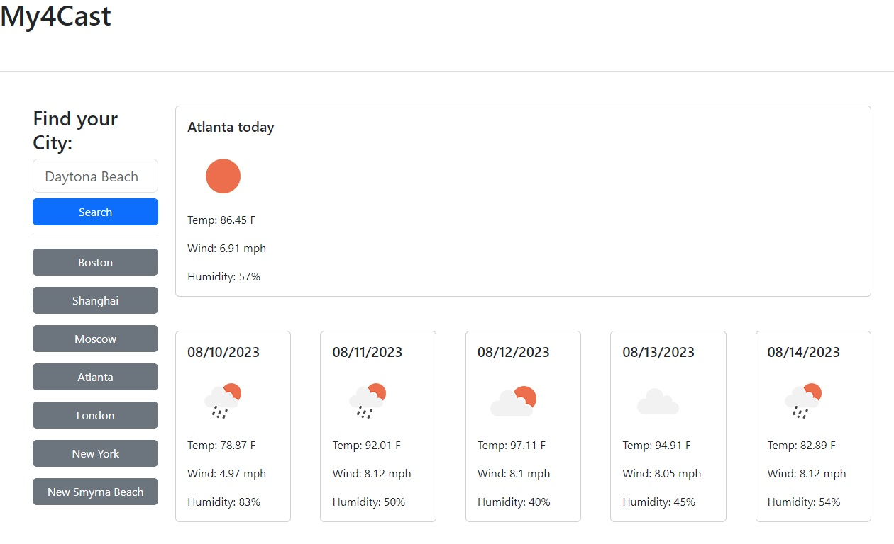

# My4Cast Weather App

[My4Cast](https://elrond-hubbard.github.io/my4cast/) delivers an accurate 5-day weather forecast for any city on earth. The app calls OpenWeatherMap API to convert city names into coordinates, and then returns weather data for that location.

## How to Use

To get a weather forecast, enter a city name in the search bar and click "Search". To view a forecast from a previously searched city, click its corresponding button in the search history column.

## Sources

[OpenWeatherMap](https://openweathermap.org)  
[DayJs](https://day.js.org/)